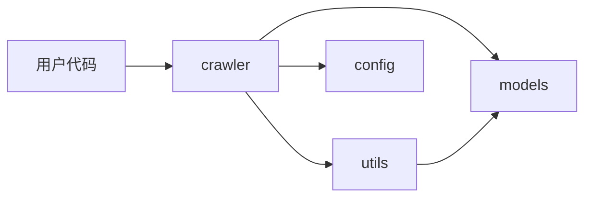
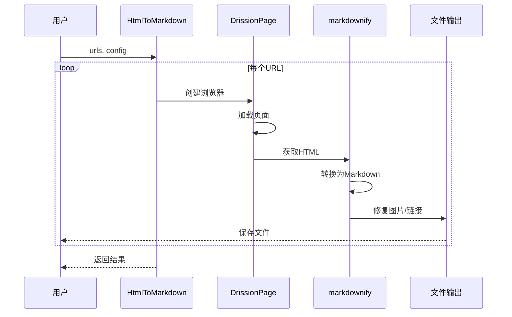
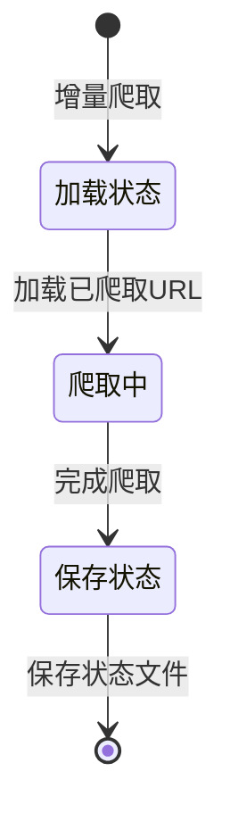

# page2md 架构设计

## 系统架构

### 整体架构

page2md 是一个基于浏览器的网页转 Markdown 工具，采用分层架构设计。

```
用户代码
    │
    ▼
┌─────────────────────────────────────────┐
│           HtmlToMarkdown 类               │
│  • 爬取调度                             │
│  • 并行处理                             │
│  • 状态管理                             │
└─────────────────────────────────────────┘
    │
    ▼
┌─────────────────────────────────────────┐
│           浏览器控制层                   │
│  • DrissionPage ChromiumPage            │
│  • 页面加载                             │
│  • 内容提取                             │
└─────────────────────────────────────────┘
    │
    ▼
┌─────────────────────────────────────────┐
│           内容转换层                     │
│  • markdownify HTML转Markdown           │
│  • 图片路径修复                         │
│  • 链接修复                             │
└─────────────────────────────────────────┘
    │
    ▼
┌─────────────────────────────────────────┐
│           文件输出层                     │
│  • 保存回调                             │
│  • 增量状态管理                         │
│  • 结果导出                             │
└─────────────────────────────────────────┘
```

## 模块划分

### 模块列表

| 模块名称 | 职责 | 核心类/函数 |
|----------|------|-------------|
| [crawler](crawler.md) | 爬虫核心逻辑 | `HtmlToMarkdown`, `crawl_urls` |
| [models](models.md) | 数据类型定义 | `CrawlResult`, `CrawlStats`, `PageMetadata` |
| [utils](utils.md) | 工具函数 | `url_to_filename`, `fix_image_paths`, `flatten_siderbar` |
| [config](config.md) | 配置管理 | `CrawlerConfig`, `DEFAULT_CONFIG` |

### 模块关系



## 技术栈

### 核心依赖

- **DrissionPage**: 浏览器自动化控制
- **markdownify**: HTML 到 Markdown 转换
- **loguru**: 日志记录
- **tqdm**: 进度条显示

### 开发环境

- **Python**: >=3.12
- **构建工具**: uv

## 数据流

### 爬取流程



### 增量爬取流程



## 核心设计

### 并行爬取

使用 `ThreadPoolExecutor` 实现多线程并行爬取，默认 5 个工作线程。

### 重试机制

每个 URL 最多重试 3 次（可配置），失败后记录错误日志继续处理下一个。

### 增量爬取

- 保存已爬取 URL 到 JSON 文件
- 再次运行时跳过已爬取页面
- 支持断点续传
