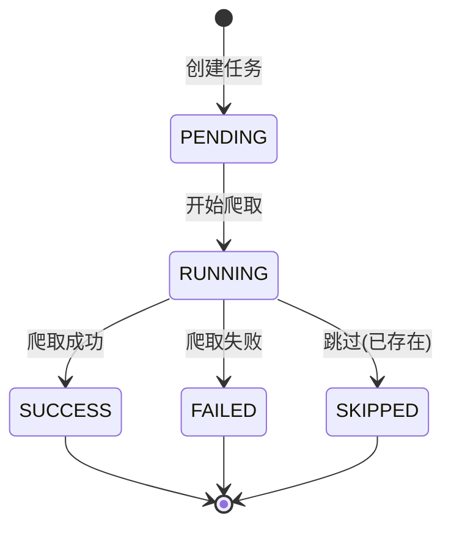
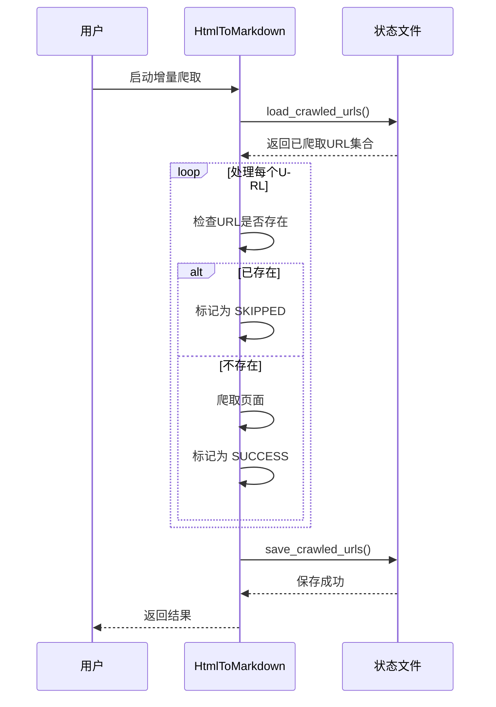

# page2md 状态设计

## 爬取状态机

### CrawlStatus 状态枚举



### 状态说明

| 状态 | 说明 | 触发条件 |
|------|------|----------|
| PENDING | 等待处理 | 任务创建后 |
| RUNNING | 正在爬取 | 开始爬取时 |
| SUCCESS | 爬取成功 | 成功获取内容 |
| FAILED | 爬取失败 | 发生异常/重试用尽 |
| SKIPPED | 跳过 | 增量爬取时已存在 |

## 增量爬取状态

### 状态管理



### 状态文件格式

```json
{
  "crawled_urls": [
    "https://example.com/page1",
    "https://example.com/page2"
  ],
  "count": 2,
  "metadata": {
    "last_update": "2024-01-01T00:00:00"
  }
}
```

## 统计信息状态

### CrawlStats 字段

| 字段 | 类型 | 说明 |
|------|------|------|
| total | int | 总数 |
| success | int | 成功数 |
| failed | int | 失败数 |
| skipped | int | 跳过数 |
| start_time | datetime | 开始时间 |
| end_time | datetime | 结束时间 |

### 派生属性

| 属性 | 计算方式 |
|------|----------|
| duration | end_time - start_time |
| success_rate | success / total * 100% |
